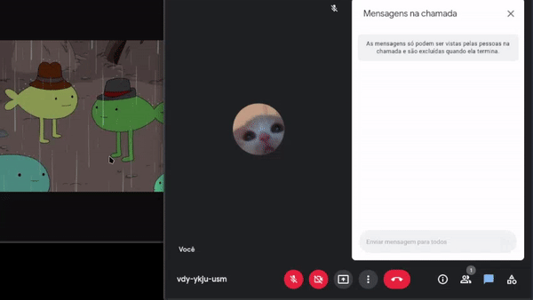

# Google Meet Image Viewer

<p align="center">
  
</p>

<div align="center">
<a href="https://github.com/eduardosouzv/meet-image-viewer/stargazers"></a>
<a href="https://github.com/eduardosouzv/meet-image-viewer/network/members"></a>
<a href="https://github.com/eduardosouzv/meet-image-viewer/pulls"></a>
</div>

<hr />

## Instalation

- Clone this repository

```
git clone https://github.com/eduardosouzv/meet-image-viewer.git
```

- Go to Chrome extensions

```
chrome://extensions/
```

- Search for a button `Load unpacked` and search by your cloned folder and select it

<hr />

## 📫 How to contribute

Follow these steps:

1. <a href="https://github.com/eduardosouzv/meet-image-viewer/fork">Fork the main repo</a>

2. Clone your fork to local machine

```
https://github.com/<your-name>/meet-image-viewer
```

3. [Install the extension on your Chrome](#Instalation)

4. Create a new branch for your changes, updates, etc.

```
git checkout -b <name-of-branch>
```

5. Make changes and <a href="https://opensource.com/article/19/7/create-pull-request-github">create a new pull request</a>

<hr />
